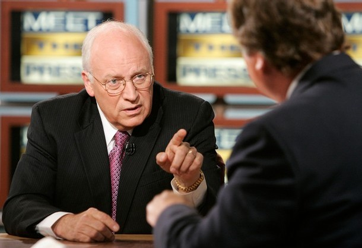

Here's a thought experiment. Suppose that a person, with knowledge of an imminent terrorist attack that will kill many people, is being held by the government. He refuses to disclose any information. Torture is guaranteed to produce the information the authorities need. Is it ethical to torture him?

This problem is called the "ticking time bomb scenario," and it trips up many moral people. Should one value the life and well-being of one intransigent detainee over the lives of hundreds of innocents? In this case, is torture not only permissable but also morally necessary?

Maybe, but there's one problem with the ticking bomb scenario. *It's irrelevant.* There never was a ticking time bomb. It's an interesting thought experiment, but, in real life, things are never so cut-and-dried. In real life, there's conflicting information about the nature, timeline, and perpetrator of a threat. Terrorists don't behave as if they're in a Hollywood movie. A detainee has never given up the "abort" code to a nuclear weapon. What's more, torture is never a reliable source of information. Subject to pain and degradation, a detainee will say *anything.*  

The aftermath of the 9/11 attacks was a terrifying time. There were threats that al Qaeda was planning another strike against the United States. Just a week after the 9/11 attacks, powdered anthrax was sent to various news organizations and two U.S. Senators. To CIA directors, it probably seemed like there was a ticking bomb threat every day. Unfortunately for the CIA and the Bush Administration, fear and the expectation of future terrorist plots do not justify brutal and illegal actions in the name of national security.

In early December, the Senate Select Committee on Intelligence released a 6,700-page report covering the CIA's torture program in excruciating detail. The Executive Summary and Findings and Conclusions of this report, written by SSCI Chairman Dianne Feinstein, is available [here](http://www.nytimes.com/interactive/2014/12/09/world/cia-torture-report-document.html). The full torture report is still classified. 

If you don't get a chance to read the report for yourself, here are the key points I gathered:

1. The CIA's use of "enhanced interrogation techniques" was not an effective means of acquiring intelligence or gaining cooperation from detainees, but the CIA coordinated the release of classified but inaccurate information to the media to distort public opinion. 

2. The interrogations and confinement conditions of CIA detainees were brutal and far worse than the CIA let on.

3. The CIA impeded congressional and White House oversight of the program, and repeatedly misled the Department of Justice, preventing a proper legal analysis of the torture program.

4. The CIA's management and operation of its Detention and Interrogation Program was deeply flawed and mismanaged, especially at its inception in 2002, when it was unprepared to take custody of its first detainee. CIA officers were untrained, unsupervised, and often conducted harsh, physical, unauthorized interrogations that were never part of the CIA's formal "enhanced" interrogation program. The CIA rarely held personnel accountable for serious violations, inappropriate activities, and systemic management failures.

5. The CIA did not accurately account for the number of detainees, and it held individuals who did not meet the legal standard for detention. Of the 119 known detainees, at least 26 were wrongfully held. 

So the CIA torture program was brutal, mismanaged, ineffective, and kept secret from the American public. 

But at least now it's out in the open, even if 56% of Americans believe that torture works. Why dig up the past? When President Obama took office in 2009, he released a set of torture memos in response to a lawsuit, and absolved those involved of the legal implications:

> In releasing these memos, it is our intention to assure those who carried out their duties relying in good faith upon legal advice from the Department of Justice that they will not be subject to prosecution.

Obama also urged Americans to "move forward with confidence" and not to "spend our time and energy laying blame for the past."

Obama's statement is a nice thought, but it has legal ramnifications he may not have considered at the time, and it is an ugly nod to the Nuremberg trials in its defense of those involved in the torture program ("I was only following orders"). American and international law doesn't give Obama the choice to "move forward" when it comes to torture carried out by the United States. The U.S. has a legal duty to prosecute torture. 

In 1988, Reagan (Reagan!) signed the UN Convention on Torture, which established a regime for international cooperation in the criminal prosecution of torturers. It defines torture as:

> **any act by which severe pain or suffering, whether physical or mental**, is **intentionally inflicted** on a person for such purposes as obtaining from him or a third person information or a confession, punishing him for an act he or a third person has committed or is suspected of having committed, or intimidating or coercing him or a third person, or for any reason based on discrimination of any kind, when such pain or suffering is inflicted by or at the instigation of or with the consent or acquiescence of a public official or other person acting in an official capacity.

The Convention also clearly states that torture is *never* justified, neither by threat of war or by orders from a higher-up:

> No exceptional circumstances whatsoever, whether a state of war or a threat or war, internal political instability or any other public emergency, may be invoked as a justification of torture. An order from a superior officer or a public authority may not be invoked as a justification of torture.

The Convention requires that each state take legislative, administrative, or judicial measures to prevent acts of torture in its jurisdiction. 

And it's clear who is responsible for the shameful torture program carried out for years by the United States. Dick Cheney has gone on Meet the Press to defend "enhanced interrogation techniques" and stated that he would "do it again in a minute": 

> I have no problem as long as we achieve our objective. And our objective is to get the guys who did 9/11 and it is to avoid another attack against the United States. I was prepared and we did. We got authorizing from the president and authorization from the Justice Department to go forward with the program. It worked. It worked now for 13 years. We've avoided another mass casualty attack against the United States. And we did capture Bin Laden. We did capture an awful lot of the senior guys at Al Qaeda who were responsible for that attack on 9/11. I'd do it again in a minute.

So why are we still debating this?
